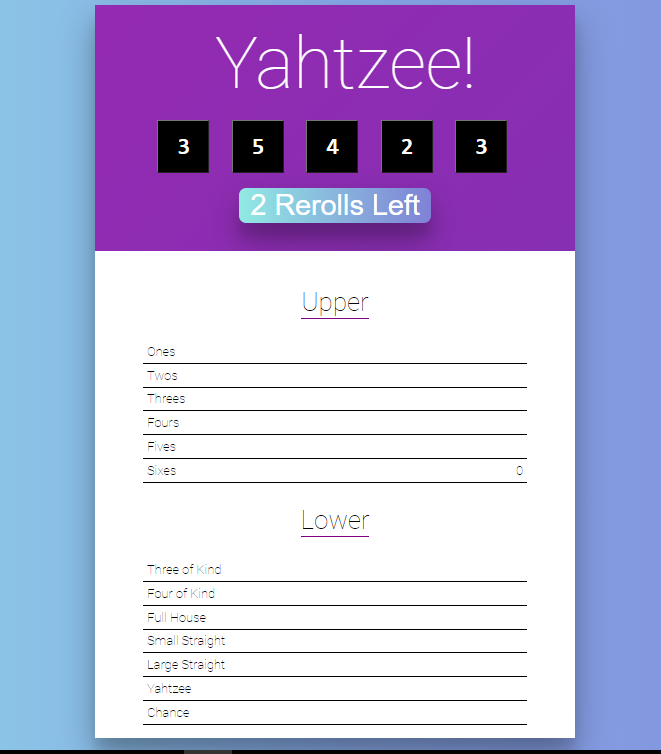

# YAHTZEE

A game where you can roll the dice and test your luck. The page lets you choose how many dice you want to roll and show the result under.

## Table of contents

- [Overview](#overview)
  - [The challenge](#the-challenge)
  - [Screenshot](#screenshot)
- [My process](#my-process)
  - [Built with](#built-with)
  - [What I learned](#what-i-learned)
- [Author](#author)

## Overview

### The challenge

Users should be able to:

- Choose the number of dice
- Roll the dice and see the result

### Screenshot



## My process

### Built with

- Semantic HTML5 markup
- CSS custom properties
- Flexbox
- Javascript
- REACTJS

### What I learned

```css
.RuleRow-disabled {
  background: linear-gradient(
    to right,
    rgba(209, 196, 233, 1) 0%,
    rgba(209, 196, 233, 1) 0%,
    rgba(209, 196, 233, 1) 30%,
    rgba(227, 242, 253, 1) 40%
  );
  background-size: 300% 300%;
  animation: Slide 1s ease 1;
}
```

```js
  roll(evt) {
    // roll dice whose indexes are in reroll
    this.setState(st => ({
      dice: st.dice.map((d, i) =>
        st.locked[i] ? d : Math.ceil(Math.random() * 6)
      ),
      locked: st.rollsLeft > 1 ? st.locked : Array(NUM_DICE).fill(true),
      rollsLeft: st.rollsLeft - 1
    }));
  }
```

## Author

- Frontend Mentor - [@manhtran1611](https://www.frontendmentor.io/profile/manhtran1611)
- Facebook - [@manhtranduc1611](https://www.facebook.com/manhtranduc1611)
